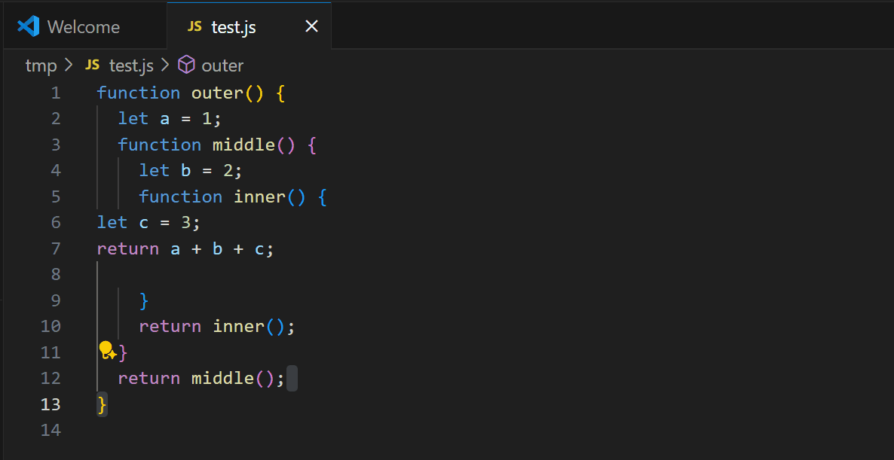

# Right-Aligned Code

**Right-Aligned Code** is a simple Visual Studio Code extension that overrides the default tab and shift+tab behavior to use indentation widths based on the Fibonacci sequence (with a multiplier of 2). Instead of a fixed number of spaces per tab, each new indentation level uses the next Fibonacci number (times 2) for the number of spaces.

For example:

- The first indent level gives 2 spaces
- The second indent level gives 2 spaces
- The third indent level gives 4 spaces
- The fourth indent level gives 6 spaces
- The fifth indent level gives 10 spaces
- ...and so on, following the Fibonacci sequence (1, 1, 2, 3, 5, 8, ...) × 2

This creates a visually interesting and non-linear indentation style.

## Features

- Overrides the default tab and shift+tab keys in the editor
- Indents and outdents lines using Fibonacci-spaced indentation (with a multiplier of 2)
- Works with any file type

## Requirements

No special requirements. Just install and use!

## Extension Settings

This extension does not add any custom settings.

## Known Issues

- Indentation is always spaces (not tabs)
- Indentation is based on leading spaces, not code structure

## Release Notes

### 0.0.1
- Initial release: Fibonacci-spaced tabbing override

---

## Following extension guidelines

Ensure that you've read through the extensions guidelines and follow the best practices for creating your extension.

* [Extension Guidelines](https://code.visualstudio.com/api/references/extension-guidelines)

## Working with Markdown

You can author your README using Visual Studio Code. Here are some useful editor keyboard shortcuts:

* Split the editor (`Cmd+\` on macOS or `Ctrl+\` on Windows and Linux).
* Toggle preview (`Shift+Cmd+V` on macOS or `Shift+Ctrl+V` on Windows and Linux).
* Press `Ctrl+Space` (Windows, Linux, macOS) to see a list of Markdown snippets.

## For more information

* [Visual Studio Code's Markdown Support](http://code.visualstudio.com/docs/languages/markdown)
* [Markdown Syntax Reference](https://help.github.com/articles/markdown-basics/)

**Enjoy!**
